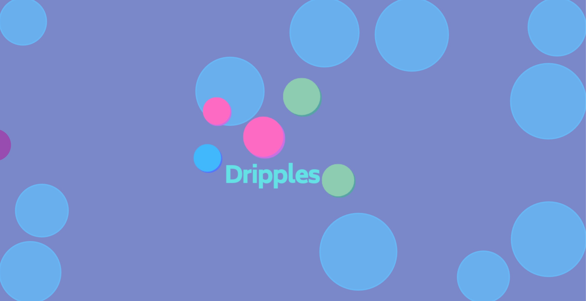

## About

Dripples is a tool to create and manage ideas. Allowing users to connect with other usings with similar ideas based on categories or related hashtags.

## Link

[Dripples](https://herdmangct.github.io/dripple-client/#/)

## Features

- Idea management platform
- Idea search engine
- User profile and idea management
- Authenticated login user interface
- Exploring nearby dripples with Google Maps API
- Private message Chat System

## Current Bugs / Limitations

- Chat system unable to initiate
- Not registering handle changes on Sign up page
- Unable to view pop up content from SearchDripples page
- The dripple elements are not fluid and dynamic, missing animations
- Validations still missing across all components

## Technologies

### Front End

- React.js
- p5.js
- Material UI
- Google Maps API
- Action Cable

### Back End

- Ruby on Rails
- Postgres Database
- Knock Gem
- Rack-cors

### Deployment

- Client deployed on Github
- Server deployed on Heroku

## Database Structure

## Future Improvements

- Sorting dripples into their own groups, when there is too many dripples in user space
- Private and public dripples
- More animations

## Challenges

- Implementing chat system. This requires more time to get it fully functional
- Animations

## Acknowledgements

Many thanks to Super Rashida and her sidekick Joel.
